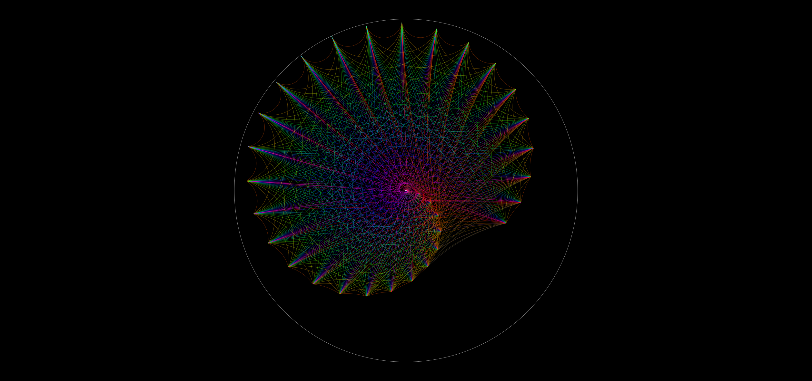

This program uses a lot of geometry to create the Poincare disc. Many of the constructions present in this code were informed by the following resource: https://www.ms.uky.edu/~droyster/courses/spring08/math6118/Classnotes/Chapter09.pdf 

